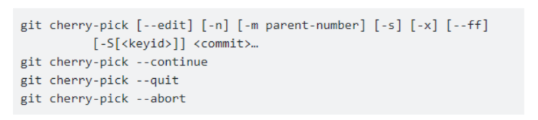
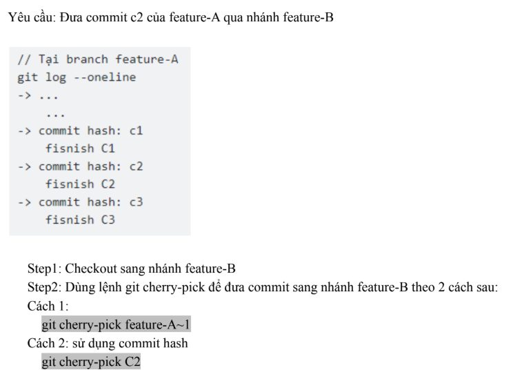
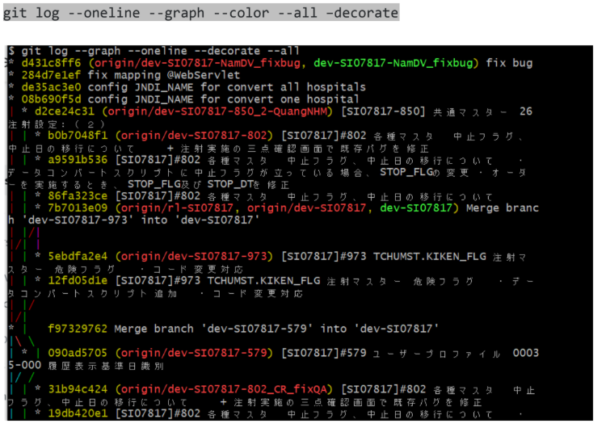
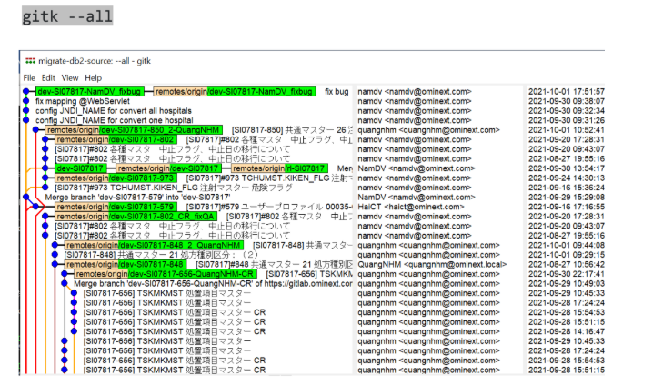
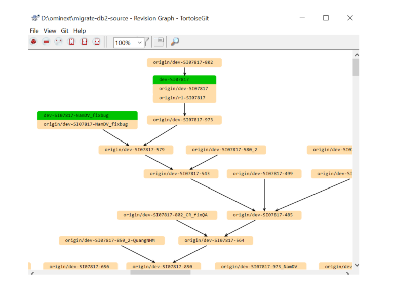
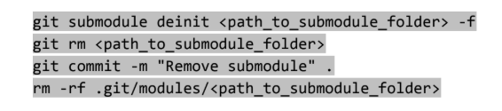

//
## ket not voi tk git

    git config --global user.name "Tên của bạn"
    git config --global user.email "email@example.com"

## Khởi tạo repo mới : 
    
    git init

## Clone repo từ GitHub:

    git clone duongdan

## Thêm file vào staging area
    
    git add . //all
    git add tenfile.txt 

## thay doi ghi chu: git commit -m "ghi chu"
## thay doi ghi chu gan nhat: git commit --amend

## Tạo nhánh mới và chuyển sang: 

    git branch ten-nhanh       # tạo nhánh
    git checkout ten-nhanh     # chuyển sang nhánh đó
## Gộp nhánh:
    
    git checkout main              # về nhánh chính
    git merge ten-nhanh           # gộp nhánh phụ vào main

- sau khi gộp xong lên xóa nhánh sau khi gộp vào đi:

        git branch -d feature/login           # Xóa local branch
        git push origin --delete feature/login  # Xóa remote branch (nếu cần)

## Hướng dẫn chỉnh sửa không nhập đúng comment code
- Các bước làm giải quyết:

      git checkout ten-nhanh

+ Thực hiện công đoạn này có thể bị conflict code đó cần Resolve conflict code. Build source code thành công. Sau khi build thành công source code sẽ thực hiện comment code.
     
      git commit --amend
+ Sau khi sửa xong thì push lại:

      git push

## Amend một commit có trước

Add các file cần commit lên.
Sau khi đã add các file cần thiết thì thực hiện lệnh

     git commit –ammend

Thực hiện push code:
o Trường hợp commit chưa được push lên remote thì sử dụng lệnh

    git push userid/task/taskid

o Trường hợp commit đã từng push lên remote rồi thì sử dụng lệnh

    git push -f userid/task/taskid

## Đẩy code lên GitHub:
    
    git remote add origin https://github.com/ten-user/ten-repo.git
    git push -u origin main

## Kéo code mới nhất từ GitHub: git pull

## Squash Commit(Gộp nhiều commit thành một commit)
Step 1:

    git log -–oneline: dùng lệnh git log để xem lịch sử commit dòng mới nhất

Step 2:

    git rebase -i HEAD~N: Xác định số lượng commit muốn gộp thành một và sử dụng lệnh git rebase

Step 3:những đoạn commit cần gộp ta sửa đoạn có chữ pick thành s và lưu lại

Step 4:Sau khi save file ở Step3 thì một cửa sổ soạn thảo mới hiển thị để thay đổi mô tả commit sau khi gộp.

Step 5: Thay đổi mô tả commit bằng cách xóa mô tả commit cũ hoặc comment lại các comment cũ bằng kí tự # ở đầu dòng, sau đó thêm mô tả commit mới rồi lưu lại

Step 6: Kiểm tra lại lịch sử commit bằng git log và push lên remote bằng git push -f.  git push -f userid/task/taskid

## Đưa commit từ nhánh này qua nhánh khác
* Ta dùng: 

      git cherry
* trong đó có các cú pháp như:

      git cherry-pick [<tùy chọn>] <commit>… :Câu lệnh chính
+ --edit: Cho phép sửa nội dung commit message sau khi cherry-pick
+ -n hoặc --no-commit:	Áp dụng thay đổi nhưng không commit ngay (để chỉnh sửa thêm trước khi commit)
+ -m <parent-number>:	Dùng khi cherry-pick một merge commit, chỉ định cha nào được chọn
+ -s:	Tự động thêm dòng Signed-off-by vào message (dùng cho quy trình kiểu Developer Certificate of Origin)
+ -x:	Ghi chú rõ commit gốc trong message (ví dụ: "cherry picked from commit abc123")
+ --ff:	Nếu có thể, thực hiện fast-forward thay vì tạo commit mới
+ -S[<keyid>]:	GPG-sign commit sau khi cherry-pick (tùy chọn dành cho bảo mật, ít dùng trong dự án nhỏ)

      git cherry-pick --continue	Tiếp tục cherry-pick sau khi bạn đã giải quyết conflict
      git cherry-pick --quit	Hủy cherry-pick hiện tại, không hoàn tác các thay đổi trong file
      git cherry-pick --abort	Hủy cherry-pick và quay về trạng thái trước cherry-pick (cực kỳ an toàn nếu có lỗi)

- Đưa 1 commit từ 1 nhánh qua 1 nhánh khác:

- Commit 1 lần cho cả 2 nhánh

+ Yêu cầu: Commit A cần apply cho 2 branch là branch-X và branch-Y
Trong trường hợp đang ở branch-X, tạo ra commit A, sau đó chuyển sang branch-Y, sau đó cherry-pick commit A với git cherry-pick

        git add -A
        git commit -m "commit A"
        
        git checkout branch-Y
        git cherry-pick branch-X

- Resolve conflict:
+ Step1: fix conflict
+ Step2: Add các file đã resolve conflict bằng git add
+ Step3: Thực hiện git cherry-pick –continue.

## Git merge và git rebase

- git merge: là một thao tác nhanh chóng sau khi merge xong thì 1 commit merge mới sẽ xuất hiện ở cuối lịch sử commit ở nhánh gốc.  
+ Ưu điểm: Thực hiện nhanh chóng và đơn giản và Merge làm cho các nhánh tồn tại trước đó không bị thay đổi
+ Nhược điểm: Lịch sử commit khi sử dụng merge nhìn khó hiểu
Cách dùng:

        git checkout feature    
        git merge master
Nếu đang ở nhánh feature, lệnh trên sẽ lấy toàn bộ thay đổi của master và gộp vào feature

- git rebase:la thao tác đưa toàn bộ những commit mới tạo ở nhánh A nối tiếp vào ngọn của nhánh B tức là thêm vào đầu tiên
+ Ưu điểm: Lịch sử commit rõ ràng, dễ theo dõi và loại bỏ những commit không cần thiết như khi sử dụng git merge
+ Nhược điểm: lịch sử commit bị ghi lại, dẫn đến khi push sẽ cần thêm tham số force và nếu có lỗi xảy ra thì sẽ khó để truy xuất xem nguyên nhân của lỗi đến từ đâu
Cách dùng: 

        git checkout feature
        git rebase master
Lấy commit mới từ feature và đặt lại sau các commit mới nhất của master, giúp lịch sử tuyến tính.

## Git stash

- Được dùng để lưu tạm thời các thay đổi chưa commit để cho ta có thể chuyển sang nhánh khác hoặc làm việc khác mà không mất công việc đang dở.

      git stash: Tạm lưu thay đổi
      
      git stash list: Xem danh sách tạm thời
      
      git stash apply: Khôi phục stash mới nhất
      
      git stash pop: Khôi phục và xóa luôn khỏi stash
      
      git stash drop stash @{n}: Xóa stash cụ thể
      
      git stash clear: Xóa toàn bộ stash
      
      git stash -u: Stash cả file chưa được track (untracked files)(-u tương đương --include-untracked)

## Git Flow

- Là mô hình quản lý nhánh (Branch Model), là chiến lược phân chia và quản lý các nhánh Git theo từng vai trò cụ thể: phát triển, tính năng, sửa lỗi, phát hành

- Các loại nhánh trong Git Flow
      Nhánh	                    Vai trò
      master (hoặc main)	    Chứa mã ổn định đã được phát hành
      develop	                Nhánh chính để phát triển; chứa code mới đã merge từ các nhánh feature
      feature/*	                Dùng để phát triển tính năng mới
      release/*	                Chuẩn bị cho một phiên bản phát hành chính thức
      hotfix/*	                Dùng để sửa lỗi khẩn cấp từ master/main

- Quy trình chuẩn Git flow
  + Bắt đầu 1 tính năng mới: 

        git flow feature start login form 
  + hoàn thành tính năng:

        git flow feature finish login-form
    
  + Chuẩn bị phát hành:

        git flow release start 1.0.0

  + Kết thúc phát hành:

        git flow release finsish 1.0.0

  + Sửa lỗi:
  
        git flow hotfix start fix-login-bug // Tạo hotfix/fix-login-bug từ master
        git flow hotfix finish fix-login-bug // Merge vào master và develop, tag bản vá
## Task FLows
- Cách bước thực hiện task:

Step 1: Báo PM/TL trạng thái để nhận được task
Step 2: Sau khi PM/TL giao task trên Backlog thì vào Backlog xem task và đổi trạng thái thành "In progress "
Step 3: Đọc spec và đi trình bày độ hiểu nghiệp vụ
Step 4: Estimate thời gian trên Backlog
Step 5:[Task Branch] Clone source tại nhánh ghi trên backlog
Step 6:[Code Branch] Code task + đổi trạng thái trên backlog
Step 7:[Merge] tạo merge request với các bước thực hiện:
+ Merge từ branch tạo ở bước [Code Branch] với branch tạo ở bước [Task Branch]
+ Assign người review là TL/PM
+ Nếu đã code xong và cần review thì add label sau
Step 8:[Review] Nhờ người review
Step 9:fixbug review
Step 10:Nhờ review lại + nếu có bug thì thực hiện lại bước step 8, trong trường hợp sửa hết lỗi thì cần nhờ những người đã review vào resolve
Step 11:Khi những người đã review resolve hết thì nhờ TL merge code vào nhánh gốc ở bước [Code Branch]
Step 12:Deploy code  cho test + nhờ test trong trường hợp test có bug thì làm lại bước [Merge] để review lại code sau khi fix bug

- Ta có thể theo dõi task thông qua Merge Request: ta sẽ thay đổi label của task để team member có thể biết được tiến độ công việc
- Các trạng thái gồm có:
+ Code done: đã được thực hiện self test, có thể tiến hành review
+ Review done: Tester có thể thực hiện test chức năng
+ Test done: Tester đã thực hiện xong việc và hết bug
+ Merged to Customer: Test đã thực hiện xong việc, Dev đã fix hết lỗi, TL/PM sẽ đánh giá sẽ mang nhánh gửi cho khánh hoặc merge vào nhánh code của khánh hàng 

## CI/CD
- Thực hiện tự động deploy cho từng nhánh task/issues

## Commit checklist
- Bao gồm các mục cần phải kiểm tra trước khi commit code

## Git graph
- Đây là 1 tính năng của git log cho phép hiển thị đồ thị các nhánh, commit của project.
- Có thể sử dụng command line hoặc tính năng show graph trên 1 số tool bên thứ 3

+ terminal:

+ Gui của OS support:

+ sử dụng gui của một số tool thứ 3 (Ví dụ: tortoisegit):

## Submodule

- Dùng để thêm một Git repository bên trong một repository, giúp cho ta dễ dàng đồng bộ source code trên repository, không cần phải clone module về để sửa, sau đó copy vào project, sau đó copy vào project, việc quản lý sẽ rắc rối hơn khi dự án
  lớn dùng nhiều submodule.
    
        git submodule add <repository> [<path>]: Thêm submodule vào project
        git submodule init:	                     Khởi tạo submodule sau khi clone
        git submodule update:	                 Cập nhật submodule theo commit được chỉ định
        git clone --recurse-submodules <repo>:	 Clone project có sẵn submodule
        git submodule foreach 'lệnh':	         Chạy lệnh trong tất cả submodule
- Remove submodule:
khi submodule không sử dụng, hoặc bị lỗi cần add lại chạy các lệnh sau để thực hiện remove submodule:

- Trong đó:
+ Repository - Địa chỉ repo cần thêm vào
+ Path - đường dẫn đến thư mục lưu repo. Nếu ta không chỉ định đường dẫn thì, repo sẽ mặc định được lưu vào thư mục có tên giống với tên repo

## Các trường hợp bị lỗi:

1:  error: failed to push some refs to 'https://github.com/Bach2910/my-note.git'
    hint: Updates were rejected because a pushed branch tip is behind its remote
    hint: counterpart. If you want to integrate the remote changes, use 'git pull'
    hint: before pushing again.
    hint: See the 'Note about fast-forwards' in 'git push --help' for details.

Giai phap:

    git pull origin Bach2910/task4 --rebase
    git push origin Bach2910/task4

2: fatal: It seems that there is already a rebase-merge directory, and
I wonder if you are in the middle of another rebase.  If that is the
case, please try    

Giai Phap:
+ cach 1: Nếu bạn muốn tiếp tục quá trình rebase:

        git rebase --continue

+ cach 2: Nếu bạn muốn hủy rebase và quay lại như cũ:

      git rebase --abort
Cuoi cung la 
    
    git pull --rebase origin Bach2910/task4

3: interactive rebase in progress; onto 41bd83e
You are currently editing a commit while rebasing branch 'Bach2910/task4' on '41bd83e'.

nghia dang trong qua trinh rebase va can xac nhan:
    
- Cach xac nhan: 
    
        git rebase --continue
- sau do push lai

4: $ git merge Bach2910/task12
merge: Bach2910/task12 - not something we can merge

xuất hiện vì Git không nhận ra Bach2910/task12 là một nhánh hợp lệ trong local hoặc remote.

cách sửa:
Bước 1: Kiểm tra danh sách nhánh hiện có

    git branch        # xem các nhánh local
    git branch -r     # xem các nhánh remote
Bước 2:  Tải nhánh task12 từ remote (nếu có)

    git fetch origin Bach2910/task12:Bach2910/task12
sau đó merge
    
    git merge tennhanh
5:fatal: refusing to merge unrelated histories(xuất hiện khi bạn đang merge hai nhánh có lịch sử commit hoàn toàn khác nhau)
Giải quyết:

    git merge Bach2910/task12 --allow-unrelated-histories

6:cach chuyen nhanh tu local sang remote

    git fetch

7:xoa bo duong dan hien tai
    
    git remote remove origin
8: để tránh việc bị up lên sẽ up nhầm toàn bộ commit của file cữ

    git checkout --orphan upload-one-file //tạo ra 1 nhánh không có commit nào trước đó
    git rm -r --cached .   # Giữ file thật, xóa khỏi Git tracking